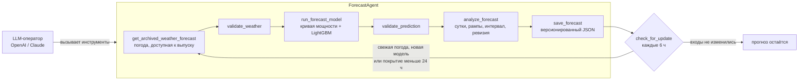

# Wind Forecast Agent — агентный прогноз выработки ВЭС на 24–48 часов

Agentic AI-система для почасового прогноза выработки двух ветротурбин. Агент сам получает по координатам турбин прогнозы погоды из открытого источника (Open-Meteo) — ровно те, что были опубликованы к моменту выпуска прогноза. Затем он готовит данные, запускает ML-модель и публикует 48 почасовых значений с калиброванным 80%-ным интервалом. После этого агент анализирует результат и пересчитывает прогноз, когда появляется более свежая погода. Поверх агента работает LLM-оператор (OpenAI или Claude): он вызывает инструменты агента и пишет брифинг диспетчеру.

Решение воспроизводит февраль 2026 года так, как если бы прогноз выпускался в прошлом: 31 января на 1–2 февраля, 1 февраля на 2–3 февраля и далее. Тот же агент работает и в реальном времени.

Мощность нормализована: `0–1` — доля номинальной мощности турбины, как в исходных данных SCADA.

## Результат в цифрах

Скользящая проверка на ноябре 2025, декабре 2025 и январе 2026. Оцениваются официальные выпуски 23:00, и модель не видит данных из оцениваемого месяца. Фактической мощности за февраль 2026 организаторы не дали, поэтому точность на тесте покажет их проверка.

| Показатель | Турбина 1 | Турбина 2 |
| --- | ---: | ---: |
| Точность, `1 − nMAE` | **83,3%** | **83,6%** |
| Средняя ошибка (nMAE), доля номинала | 16,7% | 16,4% |
| Часов, где ошибка не больше ±10% номинала | 50,7% | 53,0% |
| nMAE на горизонте 1–24 ч / 25–48 ч | 15,8% / 17,5% | 15,6% / 17,1% |
| Ошибка суточной выработки | 11,2% | 11,1% |
| Лучше эмпирической кривой мощности | 12,2% | 13,8% |
| Лучше климатологии (среднее по часу суток) | 48,3% | 48,9% |
| Пересчёт через +6 / +12 / +18 ч снижает ошибку на те же часы | 2,1% / 5,5% / 8,8% | 2,2% / 5,8% / 9,1% |
| 80%-ный интервал на проверке покрыл фактов | 87,1% | 82,6% |

Скорость на обычном ноутбуке:
- расчёт 48-часового прогноза моделью — около 30 мс;
- полный цикл агента с проверками, анализом и сохранением — около 0,2 с;
- обучение — 2–4 минуты на турбину;
- брифинг LLM-оператора — около 30 с.

Все цифры пересчитываются командой `python scripts/report_metrics.py`.

## Соответствие заданию

| Требование трека | Как реализовано |
| --- | --- |
| Модель на исторических данных | Эмпирическая кривая мощности и LightGBM на признаках погоды, обучение с 16.02.2024 по 31.01.2026 (`train.py`) |
| Прогнозы погоды из открытых источников по координатам, доступные на момент прогноза | Open-Meteo Previous Runs API. Для каждого часа берётся самый свежий запуск, опубликованный до выпуска (`src/weather.py`) |
| 24–48 часов с почасовой детализацией | 48 значений на выпуск и 80%-ный интервал |
| Полный цикл Agentic AI | `ForecastAgent`: погода → проверка → модель → проверка → анализ → публикация → повторная проверка входов и пересчёт (`src/forecast_agent.py`) |
| Прогноз «как в прошлом» с 31 января ежедневно | 28 выпусков на турбину (`predict.py`), итоговый файл `forecasts/submission.csv` |
| Архивные прогнозы, а не фактическая погода | Только `previous_dayN`; утечку проверяет `scripts/check_replay.py` |

## Как работает



1. **Погода.** Агент загружает архив Open-Meteo Previous Runs по координатам турбины. Для часа с горизонтом `L` берётся запуск `previous_dayN`, где `N = ceil((L + 12) / 24)`. Такой запуск гарантированно опубликован до выпуска. Если его нет в архиве, агент берёт более ранний: он опубликован ещё раньше и тоже допустим.
2. **Данные и модель.** `src/features.py` строит 30 признаков: ветер и температура, плотность воздуха, ветер отдельно по ECMWF, GFS и ICON и их разброс, порывы, сдвиг ветра, направление, давление, влажность, горизонт и время суток. Эмпирическая кривая мощности даёт базовую оценку, LightGBM строит итоговый прогноз, а две квантильные модели задают 80%-ный интервал.
3. **Проверки.** Полные 48 часов, отсутствие NaN, мощность в `[0, 1]`, согласованность компонентов. Неполный прогноз не публикуется.
4. **Анализ результата.** По суткам: коэффициент использования мощности, часы работы на полной мощности, пик и ожидаемая ошибка. Рампы — изменение на 30% номинала и больше за 3 часа. Отличие от предыдущего опубликованного прогноза. Пометки о необычных часах.
5. **Публикация.** Каждый прогноз сохраняется в JSON с версией, ссылкой на предыдущую версию, входными данными, их хешем, происхождением погоды и анализом.
6. **Пересчёт при обновлении входных данных.** `check_for_update` сравнивает погоду, доступную сейчас, с той, по которой построен опубликованный прогноз. Агент пересчитывает, если появились более свежие запуски, если переобучена модель или если прогноз покрывает меньше 24 часов вперёд. Иначе прогноз остаётся без изменений.
7. **Реакция на сбои.** Если допустимой погоды не хватает, агент один раз заново запрашивает Open-Meteo. Если данных всё равно нет, прогноз не публикуется. Временные сетевые ошибки повторяются.
8. **LLM-оператор** (`src/llm_agent.py`). Модель получает три инструмента: `forecast_power`, `check_for_update` и `model_quality`. Она сама решает, что вызвать, и пишет брифинг на русском. Числа в брифинге берутся только из результатов инструментов. Без ключа API тот же набор инструментов выполняется по порядку, а текст собирается по шаблону. Демонстрация от ключа не зависит.

## Что отличает решение

- **Погода без заглядывания в будущее.** Historical Forecast API склеивает первые часы последовательных запусков, и выпуск от 1 февраля получил бы погоду из запусков 2–3 февраля. Поэтому используется Previous Runs API с правилом доступности. Задержку публикации 12 ч мы измерили, а не предположили: по metadata API у самой медленной модели она 9,6 ч, у ECMWF 7,8 ч (`scripts/check_publication_delay.py`).
- **Часы SCADA определены по данным.** Корреляция ветра на турбине с ветром NWP максимальна при сдвиге UTC+6 во всех периодах. Значит, SCADA работает на фиксированном UTC+6 и не переходила на UTC+5 в марте 2024 года (`scripts/check_time_alignment.py`). Прогнозы выдаются в тех же часах, иначе они на час разошлись бы с фактом.
- **Три погодные модели как признаки.** Там, где ECMWF, GFS и ICON расходятся, смешанный прогноз ненадёжен. Это снизило ошибку ещё примерно на 6%.
- **Калиброванная неопределённость.** Ширина интервала подбирается на отдельном месяце, покрытие проверяется на следующем.
- **Пересчёт измерен, а не только реализован.** Повторный выпуск через 18 ч на те же часы точнее примерно на 9%.
- **Честная валидация.** Окна прогноза не пересекают границы фолдов. Используются только метки, закрытые к моменту выпуска. Вариант модели выбирается по правилу, зафиксированному заранее (минимальный средний MAE). Итоговая модель обучена отдельно на всей истории.
- **Воспроизводимость.** Данные, погодный кэш с хешем ответа API, модели и прогнозы лежат в репозитории, версии пакетов закреплены. Установка с нуля даёт те же модели и тот же файл сдачи бит в бит.

## Быстрый старт

Нужен **Python 3.12 или новее**: numpy 2.5 не ставится на 3.11. Проверено на Python 3.14.7. Данные, погодный кэш и обученные модели уже в репозитории, поэтому для демонстрации не нужны ни обучение, ни сеть, ни ключ API.

### Windows PowerShell

```powershell
git clone https://github.com/BAITC-Hacks/hack-8ffdfbfa-zhetysutech.git
cd hack-8ffdfbfa-zhetysutech
py -m venv .venv
.\.venv\Scripts\python.exe -m pip install -r requirements.txt
.\.venv\Scripts\python.exe -m streamlit run app.py
```

### Linux / macOS

```bash
git clone https://github.com/BAITC-Hacks/hack-8ffdfbfa-zhetysutech.git
cd hack-8ffdfbfa-zhetysutech
python3 -m venv .venv
.venv/bin/python -m pip install -r requirements.txt
.venv/bin/python -m streamlit run app.py
```

### Ключи для LLM-оператора (необязательно)

```powershell
$env:OPENAI_API_KEY = "<ключ OpenAI>"        # модель по умолчанию gpt-5.5, другая — через $env:OPENAI_MODEL
$env:ANTHROPIC_API_KEY = "<ключ Anthropic>"  # Claude Opus 5
```

`OPENAI_BASE_URL` подключает OpenAI-совместимые сервисы, например NVIDIA NIM. Ключи берутся только из переменных окружения и в репозиторий не записываются.

## Демонстрация

**Streamlit** (`app.py`):

1. Вверху показаны качество модели и скорость.
2. **«Один выпуск»**: выберите турбину и дату, оставьте включённым «Пересчёт при свежей погоде» и нажмите «Запустить агента». Вы увидите:
   - журнал вызовов инструментов;
   - график на 48 часов с 80%-ным интервалом и кривой мощности;
   - брифинг диспетчеру и анализ по суткам и рампам;
   - таблицу решений агента на проверках +6, +12 и +18 ч и график версий прогноза.
3. **«Весь февраль»**: 28 выпусков, тепловая карта «дата × час горизонта», таблица по суткам и выгрузка в CSV.
4. **«Сейчас (live)»**: прогноз от текущего часа по свежей погоде Open-Meteo. Нужна сеть.

**CLI** (`src/agent_cli.py`). Время выпуска указывается в UTC: `17:00Z` соответствует 23:00 по часам SCADA.

```powershell
# один выпуск
python -m src.agent_cli --turbine 1 --issue-time 2026-01-31T17:00:00Z
# выпуск и проверки обновлений через 6, 12 и 18 часов
python -m src.agent_cli --turbine 1 --issue-time 2026-02-03T17:00:00Z --updates 6,12,18
# брифинг диспетчеру от LLM-оператора (openai | claude | template | auto)
python -m src.agent_cli --turbine 2 --issue-time 2026-02-10T17:00:00Z --brief --llm openai
# реальное время: прогноз сейчас и проверка свежей погоды каждые 60 минут
python -m src.agent_cli --turbine 1 --live
python -m src.agent_cli --turbine 1 --watch 60
```

## Воспроизведение и проверки

```powershell
python train.py                          # CV по трём месяцам и финальные модели -> artifacts/
python predict.py                        # replay февраля -> forecasts/ (всё или ничего)
python -m unittest discover -s tests     # 44 теста
python scripts/check_replay.py           # 30 проверок replay и файла сдачи
python scripts/check_agent_replay.py     # 56 выпусков агента совпадают с replay
python scripts/report_metrics.py         # точность и скорость -> artifacts/metrics_report.json
python scripts/check_time_alignment.py   # часы SCADA = UTC+6
python scripts/check_publication_delay.py
```

Что проверяет `check_replay.py`:
- каждое значение погоды взято из запуска, опубликованного за 12 ч и больше до выпуска;
- соседние выпуски видят разные запуски погоды;
- прогноз не зависит от свежей SCADA и от погоды за горизонтом;
- ни метки обучения, ни метки выбора модели не выходят за момент первого выпуска;
- если свежего запуска нет, агент откатывается на более ранний;
- если погоды нет совсем, возникает явная ошибка, а не укороченный прогноз;
- покрыты все 672 часа февраля;
- файл сдачи корректен.

`predict.py` сначала собирает все 28 выпусков в памяти. Если хоть один не собран, скрипт завершается с ошибкой и прежние прогнозы не трогает.

## Результаты для сдачи

| Файл | Содержимое |
| --- | --- |
| `forecasts/submission.csv` | 1344 строки: для каждого часа февраля и каждой турбины прогноз из выпуска 23:00 предыдущих суток |
| `forecasts/submission_turbine{1,2}.csv` | То же по турбинам, по 672 строки |
| `forecasts/turbine{N}_{YYYY-MM-DD}.csv` | Полный 48-часовой выпуск на каждую дату |
| `forecasts/turbine{N}_february_all.csv` | Все 28 выпусков турбины в одном файле |

Колонки файла сдачи:
- `time_scada` — время по часам SCADA, UTC+6;
- `time_utc`;
- `turbine_id`;
- `prediction` — доля номинала;
- `p10`, `p90` — границы 80%-ного интервала;
- `issue_time_scada`, `lead_hours`;
- `model_version`.

## Данные, время и погода

- **SCADA**: `data/raw/turbine{1,2}.csv` — 10-минутные записи с 11.03.2023 по 31.01.2026: скорость ветра, нормализованная мощность, температура. Час `H` — среднее записей `H:00…H:50`, и он засчитывается, только если в нём не меньше 4 записей из 6. Интерполяции нет, длинные простои не заполняются.
- **Время**: внутри всё считается в UTC. Выпуск — в 23:00 по часам SCADA (17:00 UTC) на следующие двое суток SCADA.
- **Погода**: `data/cache/previous_runs_v2_*.csv.gz`. Смешанный ряд `best_match` содержит ветер на 100 м, температуру, ветер на 10 м, порывы, направление, давление и влажность. Отдельно лежит ветер на 100 м по ECMWF IFS, GFS и ICON. Рядом в JSON записаны endpoint, узлы сетки, время запроса и sha256 ответа. Архив `previous_dayN` доступен с 16.02.2024, поэтому обучение начинается с этой даты.

## Структура репозитория

| Путь | Назначение |
| --- | --- |
| `app.py` | Интерфейс Streamlit |
| `src/forecast_agent.py` | `ForecastAgent`: инструменты, проверки, анализ, версии, пересчёт |
| `src/llm_agent.py` | LLM-оператор: OpenAI, Claude, шаблон без LLM |
| `src/agent_cli.py` | CLI: выпуск, обновления, live, watch, брифинг |
| `src/ml_bridge.py` | Связь агента с погодой, SCADA и моделями |
| `src/weather.py` | Previous Runs API, кэш и правило доступности |
| `src/data.py`, `src/features.py`, `src/physics.py`, `src/model.py` | SCADA, признаки, кривая мощности, модели и интервал |
| `train.py`, `predict.py` | Обучение с валидацией, replay февраля и файл сдачи |
| `scripts/` | Проверки, замеры и отчёт по метрикам |
| `tests/` | Модульные и интеграционные тесты агента, моделей и LLM-слоя (без сети и ключей) |
| `data/`, `artifacts/`, `forecasts/` | Данные и погодный кэш, модели с манифестами, прогнозы |

## Технологии

| Технология | Роль |
| --- | --- |
| Python 3.12+, pandas, NumPy | Данные и расчёты |
| LightGBM | Прогноз мощности и квантильные модели интервала |
| Open-Meteo Previous Runs API | Архивные прогнозы погоды ECMWF, GFS, ICON |
| OpenAI SDK, Anthropic SDK | LLM-оператор с вызовом инструментов |
| Streamlit, Plotly | Интерфейс и графики |
| joblib, requests | Артефакты модели, загрузка погоды |

Точные версии зависимостей — в [requirements.txt](requirements.txt).

## Ограничения

- Точность оценена на ноябре 2025 – январе 2026. Февральский факт в данных отсутствует.
- Задержка публикации 12 ч измерена по текущим запускам (сентябрь 2026). Историческое время публикации каждого запуска Open-Meteo не отдаёт.
- Мощность нормализована: номинал и паспортные кривые турбин неизвестны, перевода в МВт нет.
- Узлы погодных сеток находятся в нескольких километрах от турбин. Систематический сдвиг из-за этого модель выучивает, локальные эффекты рельефа — нет.
- Настроены две турбины и горизонт 48 ч. Режим `--watch` — простой планировщик в процессе, а не системная служба.

## Развитие

- **Новая ВЭС** подключается координатами и историей SCADA. Погода берётся автоматически, обучение одной турбины занимает минуты.
- **Больше погодных моделей и вероятностные ансамбли** расширят интервал неопределённости по горизонту.
- **Интеграция с диспетчерской**: публикация прогноза и брифинга в API или мессенджер по расписанию `--watch`, оповещения о рампах.
- **Агрегация по ВЭС и перевод в МВт**, когда станут известны номиналы турбин.

## Развёрнутая версия

Решение запускается локально по инструкции выше. Публичной развёрнутой версии нет.
